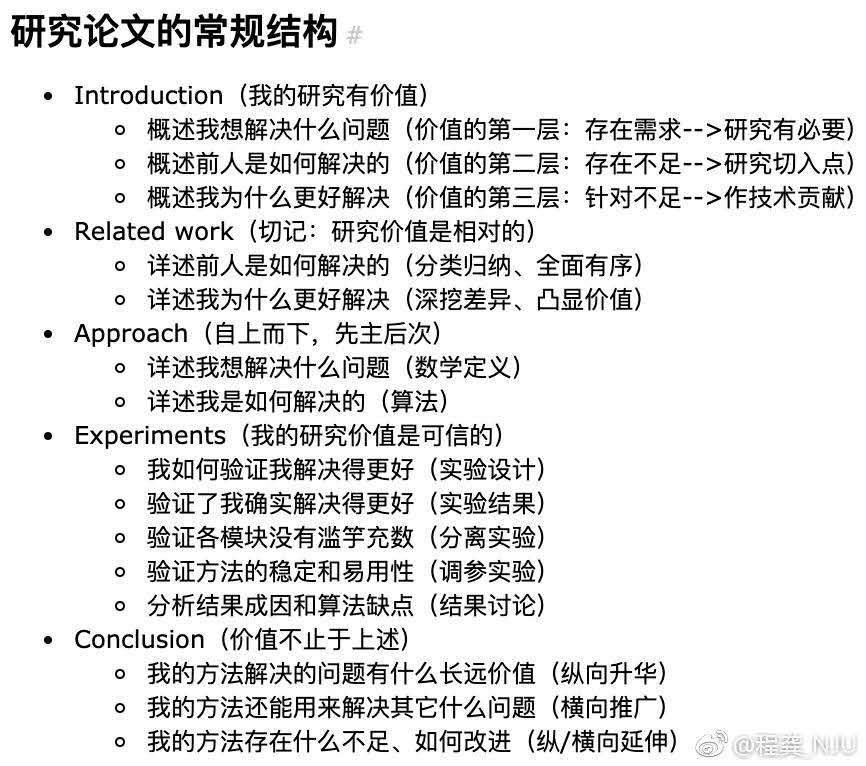

# 对Convolution操作的理解

## 1. tf.nn.conv2d

在tf.nn.conv2d中，shape参数为 [height, width, in_channels, out_channels]，对于一张图片而言，其实每个kernel都是一个包含三维tensor的weights，即 [height,width,in_channels]。

这个含义是，如果input是一个 100\*100\*3 的图片，这一层卷积层选择了共64个3\*3的卷积核。那么，每个卷积核实际上是一个 [3,3,3] 的张量，一次性对input图片的3\*3区域内3个channel进行卷积，生成output的一个feature map上的一个点。

## 2. tf.nn.depthwise_conv2d

该函数里的filter参数是一个4维tensor，包含 [ height,width,in_channels,channel_multiplier]，通过该操作的feature map的channel数量会变为$channel\_multiplier * in\_channels $。

该操作来源于深度可分卷积 [https://arxiv.org/abs/1610.02357]。

这个操作与tf.nn.conv2d不同点在于：

每个kernel分别对每个input channel进行卷积生成一个对应的feature map，然后channel_multiplier就是不同kernel的数量。比如input为 [100,100,3]，channel_multipier为3，经过一个kernel卷积后得到的输出仍然为[100,100,3]的feature map (这里假设为same 模式)。经过个kernel卷积后得到[100,100,3\*3=9]大小的feature map。

## 3. tf.nn.separable_conv2d

对tf.nn.depthwise_conv2d的一个扩展，具体为depthwise_conv2d操作后接一个pointwise卷积。

这个pointwise卷积即使用kernel shape为 [1,1,channel_multiplier*in_channels,out_channels] 的tf.nn.conv_2d，这里可以理解为对由depthwise_conv2d得到的分离的各个channel的信息进行融合。

# 研究型论文的通用架构

