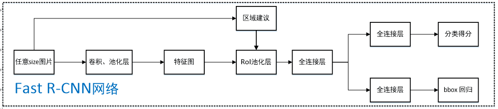

# Region-based CNN (R-CNN) #
Ref: [https://arxiv.org/abs/1311.2524]  

## **1. Main Steps**  

- 生成候选框图  

  R-CNN 使用了 Selective Search 的方法进行bounding box的生成，这是一种Region Proposal的方法。  
    生成的2000个Bbox使用NMS计算IoU指标剔除重叠的位置。  

- 针对候选图作embedding的抽取  
  Bbox直接Resize为227*227供AlexNet的输入，再Resize之前对所有BBox进行padding。  

- 使用分类器对embedding训练和分类 

## **2. Training**  

​	使用TL，在VOC数据集上进行fine-tune。原始ImageNet上训练的网络能预测1000类，这里采用了20类加背景一共21类的输出方式。  

## **3. IoU Threshold**  

​	IoU的threshold在本文被设置为0.3，如果一个区域与ground truth的IoU低于0.3，这个区域被视作Negative。

## **4. Hard Negative Mining**  

Hard Negative Mining*和 *Hard Negative Example*：  

- *Hard Negative Example*：由于根据IoU生成的bbox正样本远远少于负样本，可以IoU<0.1的样本为负样本或者使用随机抽样使正负样本比为1:3
- *Hard Negative Mining*：指一种训练手段：  在bootstrapping中，首先使用初始的较小的正负样本集训练一个分类器，随后将负样本中的错误分类的样本(hard negative)放入负样本集继续训练分类器。

## **5. Bounding Box Regression**  

​	为了解决Poor localization的问题。当输入的Proposal box和Ground truth的IoU较大时($IoU>0.6$)，可以认为二者之间存在线性变换。这里BBox Reg即给定输入的BBox特征向量(x,y,w,h)，使用y=Wx学习到的W来使P框能接近G框。  

给定的学习的变换形式为：
$$
\hat{G}_x = P_x + P_w d_x (P) \\
  \hat{G}_y = P_y + P_h d_y (P)   \\
  \hat{G}_w = P_w * e^{d_w(P)}  \\
  \hat{G}_h = P_h * e^{d_h(P)} \\
$$
但是在R-CNN中，实际上不是使用的框的坐标进行回归，而是使用pool5层的输出作为feature，学习的是预测值和真实值的偏移量t：
$$
t_i = w_i ^ {T} \phi_5(p_i) \\  
   loss = \sum_i^N (t_i - w_i^{T}\phi_5(p_i))^2 + \lambda \| w_i\|^2 \\
   其中:\\
   \begin{align}
   t_x &= (G_x - p_x)/p_w \\
   t_y &= (G_y - p_y)/p_h \\
   t_w &= \log (G_w / p_w) \\
   t_h &= \log (G_h / p_h)
   \end{align}
$$

# Fast R-CNN #
Ref: [https://arxiv.org/abs/1504.08083]  

## **1. Highlights**  

- R-CNN中用CNN对每一个BBox反复提取特征，而2000个Bbox之间有大量重叠，造成算力的浪费，这里提出共享计算的方法。 
- Fast R-CNN提出将目标分类Classification和Bbox Regression统一，形成Multi-task模型。  
- SVD全连接层，加速全连接层的运算。

## **2. Main Steps**  

如图所示：  

首先将原始图像通过conv extractor (本文使用了VGGNet) 得到一个Conv Feature map和若干Proposal Box，所有的Proposal Box (即RoI) 都为这个conv feature map上的一个rectangular window。这样，原始图上的Box和conv feature map上的Box存在一个映射关系。

使用ROI Pooling层使特征图上的RoI窗口降为固定 $ H x W $ 大小的小的feature map，再经过RoI层提取为固定长度的特征向量，送入接下来的两个并行层：classification和BBox Regression。

## 3. Image-centric Sampling

每一个mini-batch都采用层次采样，即先采样N张图片，再在图片中采样R/N个RoI框，一个mini-batch一共有R个RoI。同一张图片的RoI共享计算，降低内存开销。

## 4. Loss Function

- Log-loss
  $$
  L_{cls} = - \log p_u
  $$

- BBox Loss
  $$
  L_{loc}=\sum_{i=1}^4 g(t_i^u - v_i) \\
  g(x)=
  \begin{cases}
  0.5 x^2,  &|x| < 1 \\
  |x| - 0.5, &otherwise
  \end{cases}
  $$

# Faster R-CNN

Ref: [https://arxiv.org/abs/1506.01497]

## 1. Highlight

提出Regional Proposal Networks (RPN) 用以代替之前的Selective Search的方法，即Faster R-CNN = Fast R-CNN + RPN。

## 2. Main Steps

首先通过pre-trained的CNN作为extractor得到conv feature map作为RPN的输入，然后由RPN找到可能包含objects的regions。找到这些Region及其在原始图像中对应的位置，使用RoI Pooling操作得到fixed size的feature map，再由接下来的模块进行classification和BBox位置的调整。

## 3. Anchors

anchors使RPN网络面临的问题转化为：

* 判断anchor内是否包含object
* 调整anchor使其更加拟合object

Anchors定义在由VGGNet提取出的feature map上，即针对(conv_width,conv_height)上每一个点定义一个anchor。此处，extractor中只包含卷积层和池化层，feature map与原始图片的尺寸成比例。即：
$$
w,h \to w/r,h/r
$$
r被称为下采样率(subsampling ratio)，最终的图片是由r个像素划分的anchor集，VGGNet中r=16。

在每个anchor上放定义不同尺寸 (e.g. 64px,128px,256px) 和长宽比 (e.g. 0.5,1,1.5) 的box。

## 4. Region Proposal Networks (RPN)

在conv feasture map上进行slide window，使其满足后续ZF网络的输入。对于该feature map上的每一个点进行k次预测，比如一个8x8的feature map，取k=3，则输出8x8x3=192个ROI。

对每一个proposal region，ZF网络输出的1x1x256张量由两个dense layer分别生成2k个score用于计算cls loss和4k个parameterized coordinate计算reg loss。

## 5. Translation Invariant

anchors和产生anchor的function都是translation invariant (平移不变性) 的。

trans-variant指分类网络对物体在图形中的位置不同会改变类别预测的结果。

trans-invariant即不会改变预测结果。

本文将ROI Pooling layer置于ResNet-101层的卷积层之间，前91层用于feature extraction，之后放置一个ROI Pooling层，之后的卷积层针对每一个RoI进行feature extraction，这样使原始图像上的BBOx具有了translation vairance。

# R-FCN

ref: [https://arxiv.org/abs/1605.06409]

## 1. Framework

首先将图片由ResNet101 conv4之前的网络提取feature map，在这个feature map后接三个分支：

* 在该feature map上进行RPN操作，获得ROI
* 在feature map上获得一个 {K,K,(C+1)}维的位置敏感得分映射(position-sensitive score map)，用来进行分类
* 在feature map上获得一个 {4,K,K}维的position-sensitive score map，用于回归

随后在第二和第三项上分别执行Position-Sensitive ROI Pooling获得对应的类别和位置信息。

其与之前的R-CNN还有Faster R-CNN的区别如下图：

R-FCN的共享卷积网络为101层，直接在最后的feature map上提取ROI。

对于深度网络而言，随着目标在原始图上移动，经过多次pooling之后在最后的feature map上无法表现出来，这样会导致object detection中的bbox localization失效。

## 2. Position-sensitive score maps

用于解决translation variance问题。

一个含有类别C物体的ROI被划分为K*K个区域，分别表示物体的各个部位。该方法通过计算每个子区域的score进行vote来确定该ROI是否为object。这个score由Position-Sensitive ROI Pooling进行计算。

每个ROI  (包含x,y,w,h四个项) 被划分为K*K个bins (每个bin为一个子区域，size为h/k,w/k)，在该bin对应的score map上的子区域执行平均池化得到C+1 * K * K 个值。每个类别的 K * K个值表示该ROI属于该类别的响应值，相加即得到属于该类别的score。

