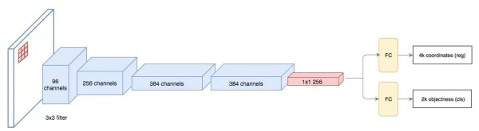
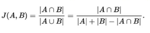

# Region-based CNN (R-CNN) #
Ref: [https://arxiv.org/abs/1311.2524]  

## **1. Main Steps**  

- 生成候选框图  

  R-CNN 使用了 Selective Search 的方法进行bounding box的生成，这是一种Region Proposal的方法。  
    生成的2000个Bbox使用NMS计算IoU指标剔除重叠的位置。  

- 针对候选图作embedding的抽取  
  Bbox直接Resize为227*227供AlexNet的输入，再Resize之前对所有BBox进行padding。  

- 使用分类器对embedding训练和分类 

## **2. Training**  

​	使用TL，在VOC数据集上进行fine-tune。原始ImageNet上训练的网络能预测1000类，这里采用了20类加背景一共21类的输出方式。  

## **3. IoU Threshold**  

​	IoU的threshold在本文被设置为0.3，如果一个区域与ground truth的IoU低于0.3，这个区域被视作Negative。

## **4. Hard Negative Mining**  

Hard Negative Mining*和 *Hard Negative Example*：  

- *Hard Negative Example*：由于根据IoU生成的bbox正样本远远少于负样本，可以IoU<0.1的样本为负样本或者使用随机抽样使正负样本比为1:3
- *Hard Negative Mining*：指一种训练手段：  在bootstrapping中，首先使用初始的较小的正负样本集训练一个分类器，随后将负样本中的错误分类的样本(hard negative)放入负样本集继续训练分类器。

## **5. Bounding Box Regression**  

​	为了解决Poor localization的问题。当输入的Proposal box和Ground truth的IoU较大时($IoU>0.6$)，可以认为二者之间存在线性变换。这里BBox Reg即给定输入的BBox特征向量(x,y,w,h)，使用y=Wx学习到的W来使P框能接近G框。  

给定的学习的变换形式为：
$$
\hat{G}_x = P_x + P_w d_x (P) \\
  \hat{G}_y = P_y + P_h d_y (P)   \\
  \hat{G}_w = P_w * e^{d_w(P)}  \\
  \hat{G}_h = P_h * e^{d_h(P)} \\
$$
但是在R-CNN中，实际上不是使用的框的坐标进行回归，而是使用pool5层的输出作为feature，学习的是预测值和真实值的偏移量t：
$$
t_i = w_i ^ {T} \phi_5(p_i) \\  
   loss = \sum_i^N (t_i - w_i^{T}\phi_5(p_i))^2 + \lambda \| w_i\|^2 \\
   其中:\\
   \begin{align}
   t_x &= (G_x - p_x)/p_w \\
   t_y &= (G_y - p_y)/p_h \\
   t_w &= \log (G_w / p_w) \\
   t_h &= \log (G_h / p_h)
   \end{align}
$$

# Fast R-CNN #

Ref: [https://arxiv.org/abs/1504.08083]  

## **1. Highlights**  

- R-CNN中用CNN对每一个BBox反复提取特征，而2000个Bbox之间有大量重叠，造成算力的浪费，这里提出共享计算的方法。 
- Fast R-CNN提出将目标分类Classification和Bbox Regression统一，形成Multi-task模型。  
- SVD全连接层，加速全连接层的运算。

## **2. Main Steps**  

如图所示：  

首先将原始图像通过conv extractor (本文使用了VGGNet) 得到一个Conv Feature map和若干Proposal Box，所有的Proposal Box (即RoI) 都为这个conv feature map上的一个rectangular window。这样，原始图上的Box和conv feature map上的Box存在一个映射关系。

使用ROI Pooling层使特征图上的RoI窗口降为固定 $ H x W $ 大小的小的feature map，再经过RoI层提取为固定长度的特征向量，送入接下来的两个并行层：classification和BBox Regression。

## 3. Image-centric Sampling

每一个mini-batch都采用层次采样，即先采样N张图片，再在图片中采样R/N个RoI框，一个mini-batch一共有R个RoI。同一张图片的RoI共享计算，降低内存开销。

## 4. Loss Function

- Log-loss
  $$
  L_{cls} = - \log p_u
  $$

- BBox Loss
  $$
  L_{loc}=\sum_{i=1}^4 g(t_i^u - v_i) \\
  g(x)=
  \begin{cases}
  0.5 x^2,  &|x| < 1 \\
  |x| - 0.5, &otherwise
  \end{cases}
  $$

# Faster R-CNN

Ref: [https://arxiv.org/abs/1506.01497]

## 1. Highlight

提出Regional Proposal Networks (RPN) 用以代替之前的Selective Search的方法，即Faster R-CNN = Fast R-CNN + RPN。

## 2. Main Steps

首先通过pre-trained的CNN作为extractor得到conv feature map作为RPN的输入，然后由RPN找到可能包含objects的regions。找到这些Region及其在原始图像中对应的位置，使用RoI Pooling操作得到fixed size的feature map，再由接下来的模块进行classification和BBox位置的调整。

## 3. Anchors

anchors使RPN网络面临的问题转化为：

* 判断anchor内是否包含object
* 调整anchor使其更加拟合object

Anchors定义在由VGGNet提取出的feature map上，即针对(conv_width,conv_height)上每一个点定义一个anchor。此处，extractor中只包含卷积层和池化层，feature map与原始图片的尺寸成比例。即：
$$
w,h \to w/r,h/r
$$
r被称为下采样率(subsampling ratio)，最终的图片是由r个像素划分的anchor集，VGGNet中r=16。

在每个anchor上放定义不同尺寸 (e.g. 64px,128px,256px) 和长宽比 (e.g. 0.5,1,1.5) 的box。

## 4. Region Proposal Networks (RPN)

在conv feasture map上进行slide window，使其满足后续ZF网络的输入。对于该feature map上的每一个点进行k次预测，比如一个8x8的feature map，取k=3，则输出8x8x3=192个ROI。

对每一个proposal region，ZF网络输出的1x1x256张量由两个dense layer分别生成2k个score用于计算cls loss和4k个parameterized coordinate计算reg loss。

## 5. Translation Invariant

anchors和产生anchor的function都是translation invariant (平移不变性) 的。

trans-variant指分类网络对物体在图形中的位置不同会改变类别预测的结果。

trans-invariant即不会改变预测结果。

本文将ROI Pooling layer置于ResNet-101层的卷积层之间，前91层用于feature extraction，之后放置一个ROI Pooling层，之后的卷积层针对每一个RoI进行feature extraction，这样使原始图像上的BBOx具有了translation vairance。

# R-FCN

ref: [https://arxiv.org/abs/1605.06409]

## 1. Framework

首先将图片由ResNet101 conv4之前的网络提取feature map，在这个feature map后接三个分支：

* 在该feature map上进行RPN操作，获得ROI
* 在feature map上获得一个 {K,K,(C+1)}维的位置敏感得分映射(position-sensitive score map)，用来进行分类
* 在feature map上获得一个 {4,K,K}维的position-sensitive score map，用于回归

随后在第二和第三项上分别执行Position-Sensitive ROI Pooling获得对应的类别和位置信息。

其与之前的R-CNN还有Faster R-CNN的区别如下图：

R-FCN的共享卷积网络为101层，直接在最后的feature map上提取ROI。

对于深度网络而言，随着目标在原始图上移动，经过多次pooling之后在最后的feature map上无法表现出来，这样会导致object detection中的bbox localization失效。

## 2. Position-sensitive score maps

用于解决translation variance问题。

由ResNet输出的tensor根据Position-sensitive Score Pooling层转为一个 有k^2*(C+1) channel的特征图，这里

一个含有类别C物体的ROI被划分为K*K个区域，分别表示物体的各个部位。该方法通过计算每个子区域的score进行vote来确定该ROI是否为object。这个score由Position-Sensitive ROI Pooling进行计算。

每个ROI  (包含x,y,w,h四个项) 被划分为K*K个bins (每个bin为一个子区域，size为h/k,w/k)，在该bin对应的score map上的子区域执行平均池化得到C+1 * K * K 个值。每个类别的 K * K个值表示该ROI属于该类别的响应值，相加即得到属于该类别的score。

# YOLO

## 1. YOLO v1

Ref: [https://pjreddie.com/media/files/papers/yolo_1.pdf]

### 1. Framework

为1-stage的object detection算法的代表，主要是去掉了Proposal Net的 过程，将物体监测作为一个回归问题进行求解。网络包含24个conv和2个全连接层，conv用于feature extractor，而dense用于预测bbox和confidence。

将输入图像分割为 S x S 个格子，每个格子为一个cell，每个cell负责检测那些中心落在该cell内的目标，会预测B个bbox以及bbox的confidence：
$$
confidence = Pr(object)*IOU_{pred}^{truth}
$$
包含框内是否有object的概率与预测框跟实际框之间的IOU的乘积，每个Bbbox的预测值包含5个元素：
$$
(x,y,w,h,c)
$$
其中x,y为相对每个单元格左上角坐标点的偏移值，w,h是关于整个图片的宽与高的比例，c为confidence。

对于分类问题，每个cell需要给出其C个类别概率值，即Pr(class|object)。

总之，每个cell需要给出(B*5+C)个值，最终S x S 个cell一共给出 S^2 * (B * 5 + C) 大小的张量。

本文采用的S = 7，B = 2。网络的预测值为一二维tensor，shape为[batch,7 * 7 * 30]。

对其切片P[:,0: 7 * 7* 20]为类别概率部分，P[:, 7 * 7 * 20: 7 * 7 * (20+2)]是置信度部分，最后的剩余部分是bbox的预测结果。

YOLO v1中，一个cell只能预测一个目标，而不像faster RCNN 能够根据anchor与ground truth之间的IOU大小来安排anchor负责预测哪一个物体。

### 3. Confidence Prediction

* 训练阶段，如果物体没有落在cell内，则Pr(object) = 0，confidence = 0，如果落在了cell内，confidence = 0 * IoU，这个IOU是实时跟ground truth相比计算出来的
* 预测阶段，网络直接输出一个confidence值

### 4. Class Prediction

* 训练阶段，对于一个cell，中心落在cell内则打上这个物体的类别label，并设置概率为1
* 测试阶段，网络输出的是 Pr(class|object)，但最终类别概率为confidence * Pr(class | object)

### 5. Loss Function

* 有物体落入的cell，计算分类loss，两个predictor都计算confidence loss，预测的bbox与ground truth IOU较大的predictor计算xywh loss

* 没有物体落入的cell，只计算confidence loss

  

## 2. YOLO v2

Ref: [https://arxiv.org/abs/1612.08242]

### 1. High Resolution Classifier

原始的YOLO v1 (以下简称为v1) 采用的224*224的图片进行与训练，然后在detection的时候采用448 * 448的输入。而在YOLO v2 (以下简称为v2) 将这一步骤分为两步，首先用224 * 224的输入从头训练网络160epoch，随后再将输入调为448 * 448 再训练10个epoch。最后再在检测的数据集上使用448 * 448 的输入进行fine-tune。

### 2. Convolutional with Anchor Boxes

v1利用dense layer直接预测bbox的坐标，而v2借鉴faster r-cnn引入anchor，将v1的dense layer和最后一个pooling层去掉。

用416 * 416 大小的输入代替原始的 448 * 448，缩小比例为32的情况下网络最后的输出feature map大小为13 * 13，这样奇数大小的feature map只有一个center。此时，若每个cell有9个anchor box，则每张图预测的box数量达到了 13 * 13 * 9 = 1521 个，而v1 每个cell预测2个bbox，每张图总共只有2 * 7 * 7 = 98 个bbox。bbox数量的增大有利于提高object的定位准确率。

### 3. Dimension Clusters

在Faster R-CNN中，anchor box的大小和比例按照经验设定若干个组合，然后在训练过程中对anchor box尺寸进行调整。v2采用了k-means对训练集的bbox做聚类来选择合适的anchor box候选集，注意这里的k-means选择的距离并非欧式距离，而是定义为
$$
d(box,centorid) = 1- IOU(box,centorid)
$$
v2中选择的k=5，而Faster R-CNN中采用了9种anchor box。

### 4. Direct Location Prediction

在region proposal的object detection算法中，通过预测t (即offset) 来得到(x,y)：
$$
\begin{align}
x &= (t_x * w_a) + x_a \\
x &= (t_y * h_a) + y_a
\end{align}
$$
xa和ya是anchor的坐标，wa和ha是anchor的size。

而v2中直接预测bbox的center相对于对应cell左上角位置的偏移，每个cell预测5个bbox，每个bbox预测5个值：

tx,ty,tw,th,to。tx和ty经过sigmoid函数处理缩放到0到1之间，cx和cy表示一个cell和图像左上角的横纵距离，如果pw和ph为anchor box的宽和高，则bx,by,bw,bh的预测的实际bbox的位置和大小为：
$$
\begin{align}
b_x & = \sigma(t_x)+c_x \\
b_y & = \sigma(t_y) + c_y \\
b_w & = p_w e^{t_w} \\
b_h & = p_h e^{t_h} 
\end{align}
\\
\sigma(t_o) = Pr(object) * IOU(b,object)
$$

### 5. Fine-Grained Features

添加一个直通层(passthrough layer)，即源码中的reorg layer，将前一层的26 * 26的feature map和本层的13 * 13的feature map进行连接，这与ResNet中的shortcut类似。

具体的，26\*26\*512 的feture map，经过passthrough层处理变成13\*13\*2048的新feature map，再与其后的13\*13\*1024feature map连接形成13\*13\*3072的map，最后在该大图上做预测。

### 6. Muti-Scale Training

v2中只有conv和pool层，因此输入图片的大小可以任意设置，所以v2采用每迭代一定轮数改变模型输入图片大小的方式使模型更robust。注意这一方式仅使用在目标数据集上fine-tuning，在ImageNet预训练时不使用。

文中采用32的倍数作为输入的图片size，包括320,352,384,416,...608共10种size。

当输入为320\*320时，输出为10\*10；输入为608\*608时，输出为19\*19，所以在最后的输出检测层部分也需进行专门的调整。

### 7. Darknet-19

使用avg pooling层代替dense层进行预测，输出为1000类，这是在ImageNet上进行预训练时的架构。

在training for detection时，移除最后的1000filters的conv和之后的avgpool和softmax。新增三个3\*3\*2014的卷积层，同时加入一个passthrough 层，最后使用1\*1的conv给出输出，输出channel数的计算如下：

对于VOC数据集，每个cell预测5个bbox，每个bbox由5个坐标和20个类别，所以每个cell有5\*(5+20) = 125个filtters。

注意这里与v1的区别，在v1里输出的filters = class + num_predictor \* (coords + confidence) = 20 + 2 \* (4+1) = 30。在v1里，每个cell对应一个类别，而在v2里每个bbox对应一个类别。

## 3. YOLO 9000

Ref: [https://arxiv.org/pdf/1612.08242v1.pdf]

### 1. Framework

YOLO9000和YOLOv2同时被提出，因为现有的detection数据集size比较小，YOLO9000利用WordTree架构将多种source的用于分类的数据集融合，利用joint optimization同时在ImageNet和COCO上进行训练。

### 2. Hierarchy Classification

通过这个wordtree的架构，只对同一个概念下的词进行softmax分类，而不是像ImageNet里那样对整个1000+类进行大的softmax进行分类。

当network输入为detection image，通过bp算法正常计算loss；为classification image时，仅仅计算相应level的classification loss。在计算某个节点的类别概率时，遍历path，然后计算path上各个节点的概率之和：

## 3. YOLO v3

Ref: [https://arxiv.org/abs/1804.02767]

### 1. Framework

输出张量为$y_1$,$y_2$和$y_3​$，由v3提出prections across scales，借鉴了feature pyramid networks (FPN)的思想，采用多尺度来对不同size的目标进行检测。

三者的channel数均为255，边长分别为13,26和52。在v3中每一个cell预测3个bbox，每个box有$(x,y,w,h,confidence)$ 五个参数，然后还有80个类别的proba，所以由3\*(80+5) = 255。

和SSD不同的是，v3采用上采样的方法实现mutl-scale的faeture map的concat。

在bounding box prediction的时候，采用了logistic regression。v3做predict的时候输出与v2相同，然后通过变换公式(见YOLO v2 Direct Location Prediction) 得到$(x,y,w,h,c)$。

这里的LR用于对anchor包围的部分进行一个目标性评分(objectness score)，即预测这块位置是目标的可能性有多大，这一步在predict之前进行，用于去掉不必要的anchor。

## SSD

Ref: [https://arxiv.org/abs/1512.02325]

### 1. Framework

* **Muti-scale feature maps**. SSD在base network (即pretrained的extractor) 之后又加入了若干的feature layers，用于多scale的offset及其confidence预测。

* **Convolutional Predictors**. 每一个被加入的feature layer使用一系列小的卷积核叫做conv predictors产生固定个数的检测预测。比如，一个尺寸为m\*n\*p的feature layer，使用一个3\*3\*p的small kernel用于产生类别score和shape offset。

* **Default boxes and aspect ratios**. 在feature map的每个位置预测K个bbox，对于每个bbox预测C个类别的分一级相对于default bbox的4个offset，这样需要(C+4)\*k个predictors，在m\*n的feature map上共产生(C+4)\*k\*m\*n个预测值，这里的default box与feature map上的每一个cell绑定。

  

### 2. Training

* **Matching strategy**. 将每个ground truth box与具有最大jaccard overlap的default box进行匹配，保证每个ground truth都有对应的default box。将每个default box与任意ground truth匹配当两者的jaccard overlap大于0.5的阈值。jaccard overlap的计算方式：

  

- **Scales and aspect ratios for default boxes**. 根据一系列之前的研究，different level的feature map拥有不同的感受野(receptive field) 大小，低层的feature map保留更多的图像细节，采用低层的feature map能够提高目标检测和图像分割的效果。在SSD中，default box不需要和每一层的感受野对应，而是特定的feature map负责图像中特定尺寸的物体。在每个特征图上，default box的尺度计算为：

  

  其中s_min为0.2，s_max为0.9。

  default box的aspect ratio有 $a_r \in {1,2,3,1/2,1/3}$，对于每个default box而言其宽高和中心计算为：
  $$
  w_k^a = s_k\sqrt{a_r} \\
  h_k^a = s_k / \sqrt{a_r} \\
  center = (\frac{i+0.5}{|f_k|},\frac{j+0.5}{|f_k|})
  $$
  $|f_k|$为第k个feature map的size，$i,j \in [0,|f_k|]$。

  对于$a_r = 1$的情况，加入一个额外的 $ s_k ^{\prime}= \sqrt{s_k s_{k+1}}$ scale的box，这样对于每个feature map的location而言共有6个default box。

  作者指出，在特定数据集上可以设计特定的default box的分布以获得更好的性能。

  